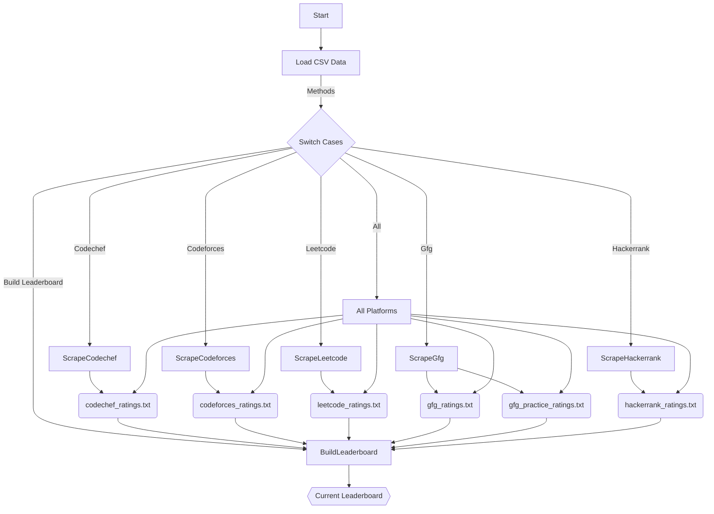
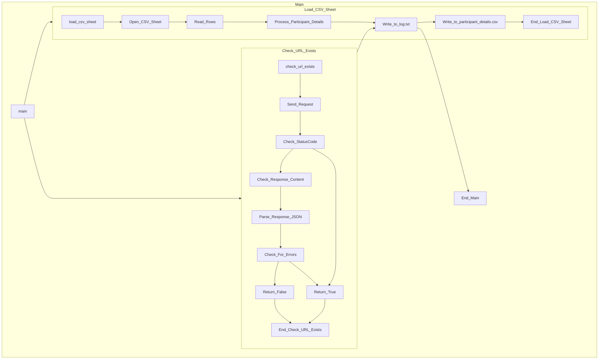
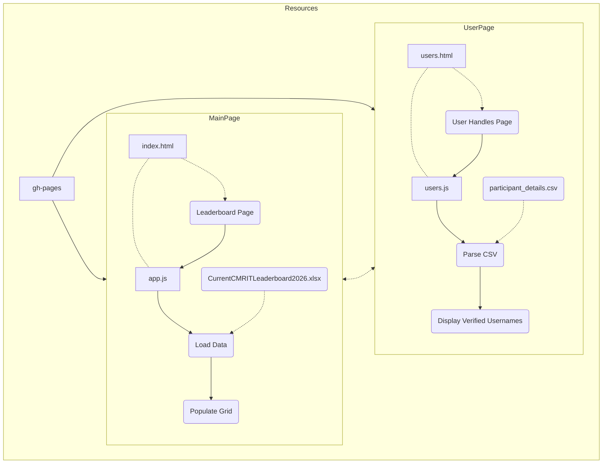

# CMRIT 2026 Batch AutoUpdating Leaderboard.

[](https://github.com/gabyah92/CMRIT2026Leaderboard/actions/workflows/gradle.yml)

**The autoupdating leaderboard of CMR Institute of Technology, 2026 batch.**

**The scores of CMRIT 2026 Batch will automatically be mapped at https://gabyah92.github.io/CMRIT2026Leaderboard/ based on usernames from https://tinyurl.com/2026-CODING-USERNAMES**

**Many thanks and gratitude to [Rushyendra(21r01a67e6)](https://github.com/dog-broad) for his contributions on this projects UI, Code, Yaml and so much more! This project would not be working were it not for his relentless efforts!**

## Introduction
This project aims to create and maintain a leaderboard for participants from CMR Institute of Technology (CMRIT) for the year 2026. The leaderboard displays ratings and statistics of participants from various coding platforms such as Codeforces, LeetCode, GeeksforGeeks, Codechef, and Hackerrank.


## Project Features

This project offers several functionalities designed to streamline leaderboard creation and management:

**1. Comprehensive Leaderboard Generation:**
* **Platform Data Scraping:** The project automatically scrapes data from various coding platforms, including CodeForces, GFG, LeetCode, CodeChef, and HackerRank.
* **Data Processing and Ranking:** Scraped data is then processed to calculate ratings and percentiles for participants, ultimately generating a comprehensive leaderboard.

**2. Enhanced Automation:**
* **GitHub Actions Integration:** The project leverages GitHub Actions workflows to automate crucial tasks, including:
    * **Build Process:** Building the project from scratch is automated for efficiency and consistency.
    * **Test Execution:** Automated testing ensures the project functions as intended, catching potential issues early on.
    * **Additional Tasks:** Depending on the specific workflow configuration, other tasks like artifact uploading and downloading can also be automated.

**3. User-Friendly Web Interface:**
* **Visualized Data:** A dedicated web interface allows users to easily access and explore the generated leaderboard data. This interface provides a clear and interactive presentation of participant information.

**4. Robust Data Management:**
* **SQLite Database Storage:** Participant details are securely stored in an SQLite database, ensuring data persistence and efficient retrieval.
* **CSV File Integration:** The project facilitates data loading from a CSV file, offering flexibility in participant data management.
* **URL Verification:** For each participant, the project verifies the existence of URLs associated with their coding platform handles, enhancing data accuracy.

## Project Structure Overview

The project's source code is organized into well-defined directories for clarity and maintainability:

* **src/main/java/org/cmrit/**: This directory houses all the Java source files responsible for scraping data, processing it, and ultimately generating the leaderboard.
* **usernameVerifier/main.py**: This Python script handles participant data loading from an Excel sheet, checks the existence of URLs associated with their handles, and writes the processed details to CSV and log files.
* **.github/workflows/**: This directory contains the GitHub Actions workflows that automate various tasks within the project lifecycle, such as builds and tests.
* **src/main/resources/**: This directory stores the HTML files used to build the web interface and other essential resources utilized by the project.


## Setting Up the Project

This section guides you through the steps required to set up and run the project effectively. 

**1. Obtaining the Code:**

* **Git Clone:**  Begin by cloning this repository to your local development environment using the following command in your terminal:

```bash
git clone https://github.com/gabyah92/CMRITLeaderboard2026.git
```

If you have forked the Repo, replace `gabyah92` with your actual GitHub username. This will download the project's source code to your local machine.

**2. Gradle Installation:**

* **Prerequisite:** To successfully build and run this project, you'll need the open-source build automation tool Gradle installed on your system. 
* **Installation Instructions:** If you haven't already, download and install Gradle following the official installation guide: [https://gradle.org/install/](https://gradle.org/install/)

**3. Downloading Dependencies:**

* **Dependencies:** This project uses external libraries to function correctly. These libraries are defined in the `build.gradle` file.
* **Installation:** To download and install these dependencies, navigate to the project directory in your terminal and execute the following command:

```bash
gradle build
```

This command instructs Gradle to download the necessary libraries and configure the project's build environment.

**Additional Notes:**

* Ensure you have Java installed on your system for the `CMRITLeaderboard2026.java` file to execute successfully.
* Refer to the project documentation for further details on available functionalities and configuration options.


## Running the Jar File

* **Jar Generation:** After executing `gradle build` in the previous step, a JAR file named `CMRIT2026Leaderboard-1.0-SNAPSHOT.jar` will be created within the `build/libs` directory.

* **Execution:** To run the generated JAR file, navigate to the `build/libs` directory in your terminal and execute the following command:

```bash
java -jar CMRIT2026Leaderboard-1.0-SNAPSHOT.jar <options>
```

* **Available Options:**

The following options are available to specify which leaderboard to generate or to build the overall leaderboard:

- `codeforces`
- `gfg`
- `leetcode`
- `codechef`
- `hackerrank`
- `all`
- `build_leaderboard`

**Example:**

To generate the leaderboard for CodeChef, you would use the command:

```bash
java -jar CMRIT2026Leaderboard-1.0-SNAPSHOT.jar codechef
```

Do this for all subesequent platforms to generate necessary files or use `all` option to generate them all at once

To build the overall leaderboard comprising scores from all platforms, use:

```bash
java -jar CMRIT2026Leaderboard-1.0-SNAPSHOT.jar build_leaderboard
```

## Components
- **Generating Leaderboard:** Execute the main Java files using Gradle to scrape data from coding platforms, process it, and generate the leaderboard.

- **Data Handling:** Use the Python script `main.py` to load participant data from an Excel sheet, check URL existence, and manage details.

- **Web Interface:** Access the web interface to view and interact with the leaderboard.


## Contributing
Contributions are welcome! Feel free to submit issues for bug fixes, feature requests, or improvements. Pull requests are also appreciated for implementing new features or fixing existing issues.

## Acknowledgments
- This project is inspired by the need to showcase the coding prowess of CMRIT students and provide a platform for recognition.

## Disclaimer
This project is not officially affiliated with CMR Institute of Technology (CMRIT). It is an independent initiative by coding enthusiasts.

